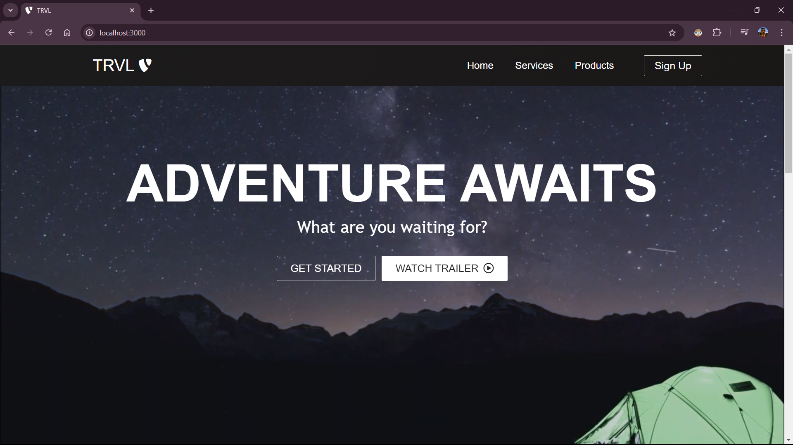
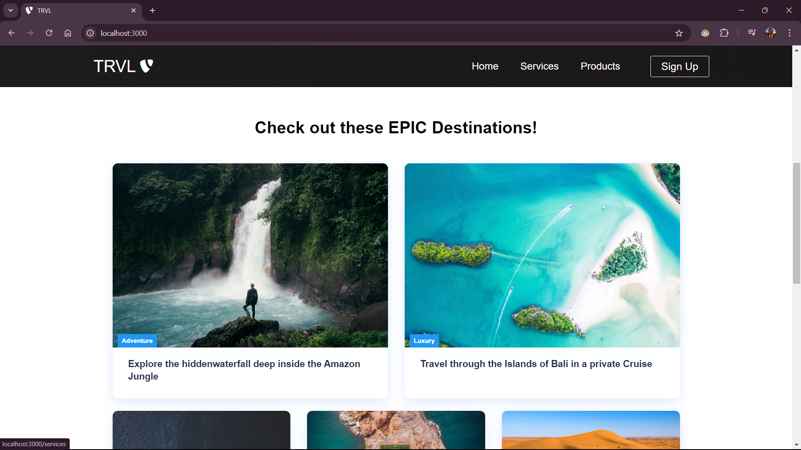
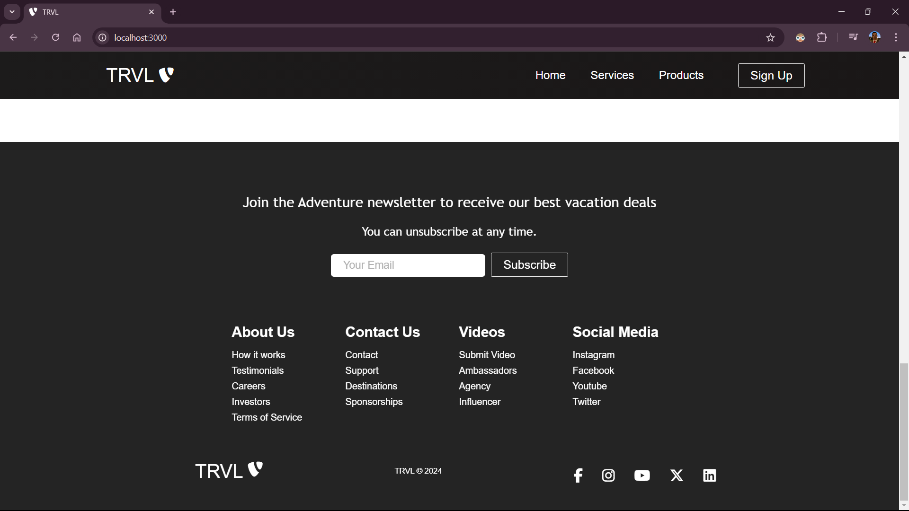

# TRVL

TRVL is a responsive travel website created as a practice project. It showcases various destinations utilizing modern web development technologies like HTML, CSS, and ReactJS. The project demonstrates skills in front-end design and development, with an emphasis on responsive layouts and user-friendly interfaces.

## Tech Stack

- **Frontend:** ReactJS
- **Styling:** CSS
- **Icons:** Font Awesome
- **State Management:** React Hooks (useState, useEffect)

## Installation

1. Clone the repository:
   ```bash
   git clone https://github.com/promishgrg98/trvl.git
2. **Navigate to the project directory:**
   ```bash
   cd trvl
3. **Install the dependencies:**
   ```bash
   npm install
4. **Start the development server:**
   ```bash
   npm start
The application will be available at http://localhost:3000.

## Screenshots




